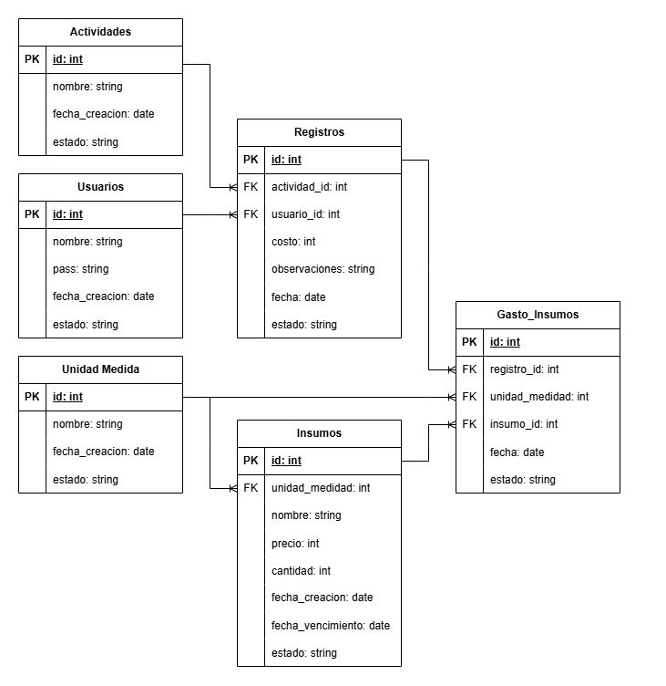

# Proyecto de Arquitectura de Software para Aplicativo Web – Componente Base de Datos

_Este documento servirá como guía y registro de todo el proceso de Base de Datos._

---

## 1. Modelo de datos

Con base en los requerimientos y alcance del proyecto, se decide crear un modelo de datos que contempla las entidades **Actividades**, **Usuarios** e **Insumos** como ejes centrales. Adicionalmente, se crean tablas intermedias como **Registros** y **Gasto_Insumos** para gestionar las relaciones complejas y el flujo de información principal del sistema.

---

## 2. Descripción de las Entidades (Tablas)

### 2.1 Usuarios

| Campo            | Tipo      | Descripción                                                                 |
|------------------|-----------|-----------------------------------------------------------------------------|
| `id`             | PK, int   | Identificador único para cada usuario.                                      |
| `nombre`         | string    | Nombre del usuario.                                                          |
| `pass`           | string    | Contraseña para la autenticación (se recomienda almacenar un hash).          |
| `fecha_creacion` | date      | Fecha en que se creó el usuario.                                            |
| `estado`         | string    | Indica si el usuario está activo, inactivo, etc.                            |

---

### 2.2 Actividades

| Campo            | Tipo      | Descripción                                                                                     |
|------------------|-----------|-------------------------------------------------------------------------------------------------|
| `id`             | PK, int   | Identificador único para cada actividad.                                                       |
| `nombre`         | string    | Nombre descriptivo de la actividad (p. ej., “Mantenimiento General”, “Limpieza de área”).       |
| `fecha_creacion` | date      | Fecha en que se definió la actividad.                                                          |
| `estado`         | string    | Indica si la actividad está disponible para ser registrada.                                    |

---

### 2.3 Unidad Medida

| Campo            | Tipo      | Descripción                                           |
|------------------|-----------|-------------------------------------------------------|
| `id`             | PK, int   | Identificador único para la unidad de medida.         |
| `nombre`         | string    | Nombre de la unidad (p. ej., “Kg”, “Lt”, “Un.”).      |
| `fecha_creacion` | date      | Fecha de registro de la unidad.                       |
| `estado`         | string    | Estado de la unidad de medida.                        |

---

### 2.4 Insumos

| Campo               | Tipo      | Descripción                                                                                         |
|---------------------|-----------|-----------------------------------------------------------------------------------------------------|
| `id`                | PK, int   | Identificador único del insumo.                                                                     |
| `unidad_medida_id`  | FK, int   | Referencia a **Unidad Medida** para definir cómo se cuantifica el insumo.                           |
| `nombre`            | string    | Nombre del insumo (p. ej., “Aceite Motor”, “Tornillos 1/4”).                                        |
| `precio`            | int       | Costo unitario del insumo.                                                                          |
| `cantidad`          | int       | Stock o cantidad disponible del insumo.                                                             |
| `fecha_creacion`    | date      | Fecha en que el insumo se da de alta.                                                               |
| `fecha_vencimiento` | date      | Fecha de caducidad del insumo, si aplica.                                                           |
| `estado`            | string    | Condición actual del insumo (disponible, agotado).                                                  |

---

### 2.5 Registros

| Campo           | Tipo      | Descripción                                                                                         |
|-----------------|-----------|-----------------------------------------------------------------------------------------------------|
| `id`            | PK, int   | Identificador único del registro.                                                                   |
| `actividad_id`  | FK, int   | Referencia a **Actividades** para saber qué tarea se realizó.                                       |
| `usuario_id`    | FK, int   | Referencia a **Usuarios** para identificar quién realizó la actividad.                              |
| `costo`         | int       | Costo asociado al registro (total o valor específico de mano de obra).                              |
| `observaciones` | string    | Campo de texto libre para detalles adicionales.                                                     |
| `fecha`         | date      | Fecha y hora en que se efectuó el registro.                                                        |
| `estado`        | string    | Estado del registro (finalizado, en proceso).                                                       |

---

### 2.6 Gasto_Insumos

| Campo               | Tipo      | Descripción                                                                                       |
|---------------------|-----------|---------------------------------------------------------------------------------------------------|
| `id`                | PK, int   | Identificador único del gasto.                                                                    |
| `registro_id`       | FK, int   | Referencia a **Registros** para asociar el gasto a una actividad concreta.                        |
| `unidad_medida_id`  | FK, int   | Referencia a **Unidad Medida** utilizada en esta transacción específica.                         |
| `insumo_id`         | FK, int   | Referencia a **Insumos** que se utilizó.                                                         |
| `fecha`             | date      | Fecha del gasto.                                                                                  |
| `estado`            | string    | Estado del gasto (confirmado, cancelado).                                                        |

---

## 3. Relaciones entre Entidades

- **Usuarios → Registros** (1-N)  
  Un usuario puede crear múltiples registros, pero cada registro pertenece a un solo usuario.

- **Actividades → Registros** (1-N)  
  Una actividad puede ser registrada muchas veces, pero cada registro corresponde a una única actividad.

- **Unidades de Medida → Insumos** (1-N)  
  Una unidad de medida (p. ej., “Kilos”) se puede aplicar a muchos insumos, pero cada insumo tiene una sola unidad de medida principal.

- **Registros ↔ Insumos** (N-M)  
  Resuelta mediante la tabla **Gasto_Insumos**:  
  - Un registro puede implicar el gasto de varios insumos.  
  - Un mismo insumo puede ser gastado en diferentes registros.  
  - **Gasto_Insumos** actúa como punto de unión, detallando qué insumo se usó, en qué cantidad y para qué registro.